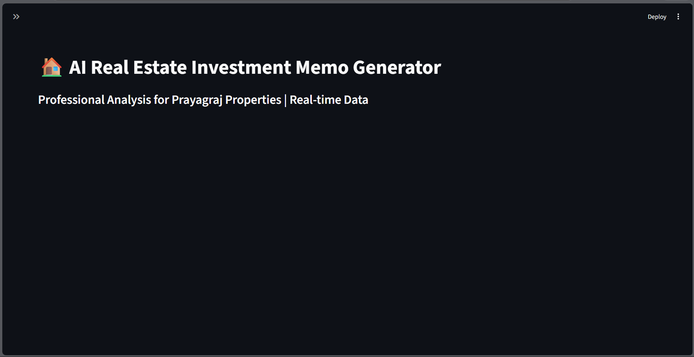
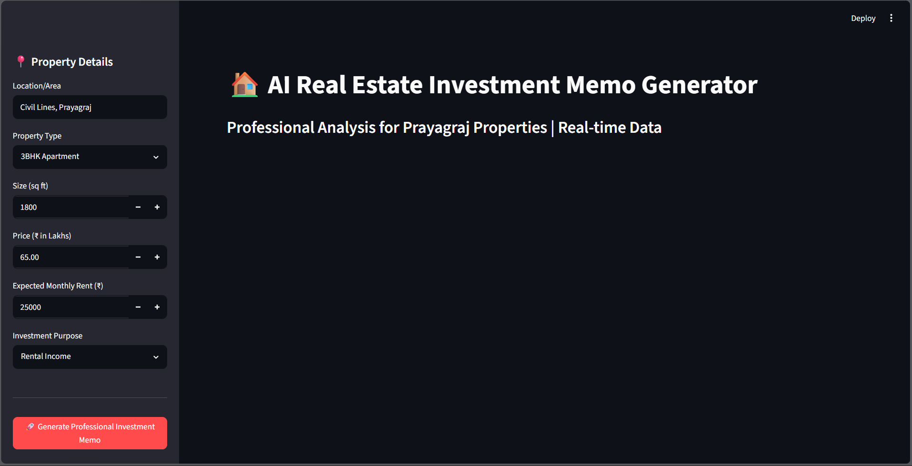
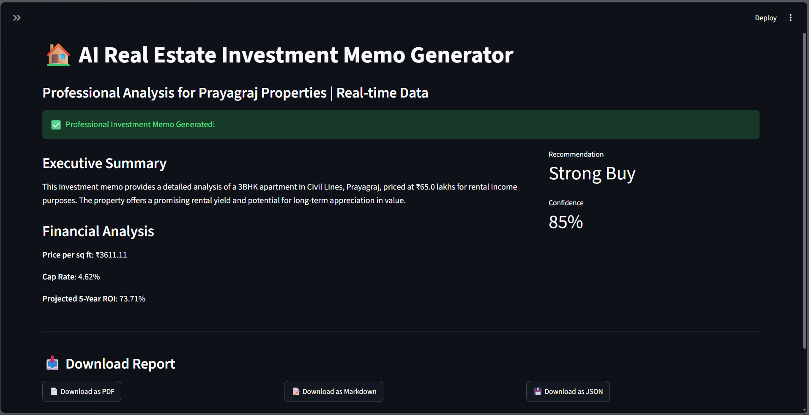

# 🏠 Prayagraj Real Estate AI Investment Memo Generator

An intelligent **RAG + Generative AI + Financial Analysis** system that generates professional investment memos for real estate properties in Prayagraj (Allahabad), India.


---

## ✨ Key Features

- **Real-time Market Intelligence** — Uses DuckDuckGo for latest property rates, infrastructure news & trends
- **Advanced Financial Engine** — Auto calculates Cap Rate, Price/sqft, Cash-on-Cash Return, Projected 5-Year ROI
- **Professional Investment Memos** — Structured, analyst-grade reports with clear recommendations
- **Multiple Export Formats** — PDF (Professional), Markdown, and JSON
- **Beautiful Streamlit UI** — User-friendly interface with sidebar inputs
- **Hybrid RAG Architecture** — Combines static knowledge base + real-time web search

---

## 🛠️ Tech Stack

- **LLM**: Groq (Llama-3.3-70B / Llama-3.1-8B)
- **Framework**: LangChain
- **Embeddings**: BAAI/bge-small-en-v1.5
- **Vector Store**: Chroma
- **Frontend**: Streamlit
- **Search**: DuckDuckGo
- **PDF Generation**: ReportLab
- **Financial Modeling**: Custom Python Engine

---

## 🚀 Quick Start

### 1. Clone the Project
```bash
git clone https://github.com/Suycode05/real-estate-memo_generator.git
cd prayagraj-real-estate-ai
2. Create Virtual Environment
python -m venv venv
venv\Scripts\activate     # For Windows
3. Install Dependencies
pip install -r requirements.txt
4. Environment Variables
Create a .env file in root:
envGROQ_API_KEY=gsk_your_groq_api_key_here
5. Run the Application
streamlit run app.py

📁 Project Structure
textprayagraj-real-estate-ai/
├── app.py                    # Streamlit UI + PDF Export
├── rag_pipeline.py           # RAG Chain & Memo Generation
├── financial_calculator.py   # Financial Analysis Engine
├── dynamic_search.py         # Real-time DuckDuckGo Search
├── main.py                   # Testing script
├── chroma_db/                # Vector Database (auto-created)
├── .env
├── requirements.txt
└── README.md

🎯 Core Capabilities

Real-time data fetching for latest market trends
Accurate financial calculations tailored for Indian real estate
Professional PDF reports suitable for investors and portfolio use
Balanced risk analysis and investment recommendations
Focused on Prayagraj market (Circle Rates, RERA, Infrastructure)


📸 Demo





🔮 Future Enhancements

 Multi-city support (Lucknow, Varanasi, Kanpur, etc.)
 Multi-agent system for deeper analysis
 User authentication & saved reports
 Historical price trend analysis
 WhatsApp/Email sharing
 Fine-tuned domain LLM


🤝 Contributing
Contributions are welcome! Feel free to open issues or submit pull requests.

📄 License
This project is developed for learning, portfolio, and demonstration purposes.

👨‍💻 Author
Suyash Tripathi
AI Engineer | Building Intelligent Systems for Real Estate & Finance

Built with ❤️ using LangChain, Groq, Streamlit & DuckDuckGo